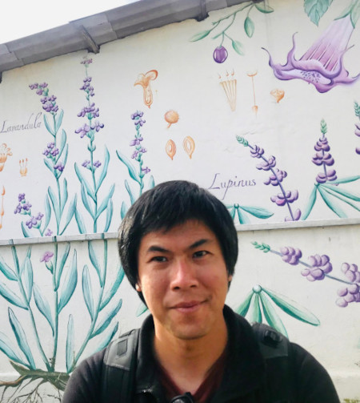

<!-- menubar: menu_people -->
<!-- menubar_toc: true -->

## PI - Steven H. Wu

<!-- {:width="128px"} -->

Steven Wu is an Assistant Professor in the [Department of Agronomy](http://www.agron.ntu.edu.tw/) at [National Taiwan University (NTU)](https://www.ntu.edu.tw/). His primary research interests are developing statistical and computational models to address challenges in agriculture, metagenomics, and evolution. He was the head of bioinformatics at an agriculture startup in California, USA, postdoctoral associate at Arizona State and Duke University. With unique experiences in both academics and industry, he can get the best out of both worlds.

Contact:
<i class="fas fa-at"></i> [Email](mailto:stevenwu@ntu.edu.tw)
<i class="fas fa-link"></i> [NTU Website](http://www.agron.ntu.edu.tw/cp_n_74935_s_30778.html)
<i class="fab fa-google"></i> [Google Scholar](https://scholar.google.com/citations?user=7nxUa9IAAAAJ&hl=en)  
<i class="fab fa-github"></i> [GitHub](https://github.com/stevenhwu)
<i class="fab fa-orcid"></i> [ORCID](https://orcid.org/0000-0002-7685-8009)
<i class="fab fa-linkedin"></i> [Linkedin](https://www.linkedin.com/in/steven-wu-0/)

  

#### Experience and Education

|                                                           |                                               |                              |
| --------------------------------------------------------- | --------------------------------------------- | ---------------------------- |
| 2017 - 2021                                               | BioConsortia, Inc. Davis, CA, USA.            | Head of bioinformatics       |
| 2014 - 2017                                               | Arizona State University. AZ, USA.            | Postdoctoral Associate       |
| 2010 - 2014                                               | Duke University. NC, USA.                     | Postdoctoral Associate       |
| 2006 - 2010 (Eligible)   2014 (Applied for graduation) | University of Auckland. Auckland, New Zealand | Ph.D. in biology             |
| 2002 - 2006                                               | University of Auckland, Auckland, New Zealand | BSc.(Hons) in Bioinformatics |

<!--
| ---: | :--- | :---: |
<i class="fas fa-envelope"></i>
-->

<!-- 
 -->
<!--

 -->

<!-- hr.solid {
  border-top: 8px solid #bbb;
border-radius: 5px;
}

/* Rounded border */
hr.rounded {
  border-top: 8px solid #bbb;
  border-radius: 5px;
} -->



<!-- Master -->
## [Master's students](#masters-students)

#### [Shawn Chen](/personal_page/shawn_chen)

Shawn is a senior student. He always sits in front of the computer, seeming like the chair and keyboard have trapped him. If you see him stuck in some trouble, don't worry; he's doing it voluntarily.

<i class="fas fa-at"></i> [Email](mailto:shawn.for.office@gmail.com)



#### [Rui-Ting Xie](/personal_page/rui_ting_xie)

Ruei-Ting is a senior student at National Taiwan University. He's 23 and studying agronomy. The name on his passport was Ruei Ting Hsieh, but it seems like it's too hard to remember or something, so it's shown as Rui Ting Xie on the website ("Hsieh" is really hard to remember; he even spells it wrong himself sometimes). Now, he's getting nearly killed by his project on protein sequences and excel class.

<i class="fas fa-at"></i> [Email](mailto:b10601006@ntu.edu.tw)
<i class="fa-brands fa-discord"></i> [Discord](discordapp.com/users/810902904071651428)
<i class="fa-brands fa-instagram"></i> [Instagram](https://www.instagram.com/godtim_hsieh?igsh=MWI3NGo3ZDJldHM5YQ%3D%3D&utm_source=qr)



#### [Rex Wang](/personal_page/rex_wang)

Rex is currently a first-year master’s student in the Division of Biometry. He graduated from National Chengchi University with a degree in Statistics. Right now, he’s mainly working on projects related to pest control and pest prediction. During his first semester of grad school, his main focus has been sharpening his programming skills and trying his best to pick up more biology knowledge, which he feels he’s a bit lacking in. 

<i class="fas fa-at"></i> [Email](mailto:rexwang1229@gmail.com)



<!-- Undergraduate -->
## [Undergraduate students](#undergraduate-students)

#### [Xiang-Lin Liu](/personal_page/xiang_lin_lu.md)

<i class="fas fa-at"></i> [Email](mailto:b11601013@ntu.edu.tw)  



#### [Jonathan Liew](/personal_page/jonathan_liew.md)

Undergraduate student in the Department of Agronomy, National Taiwan University. Currently focusing on a pathway project that uses semi-automatic query features to extract and connect the metabolic pathways from a list of enzymes.

<i class="fas fa-at"></i> [Email](mailto:b11601014@ntu.edu.tw)  



#### [Kuan-Yu Chen](/personal_page/kuan_yu_chen.md)

<i class="fas fa-at"></i> [Email](mailto:b10601035@ntu.edu.tw)  



<!-- Alumni -->
## Alumni
<!--  -->

### Masters students

#### [Szu-Ting Tan](/alumni/szu_ting_tan) - 2025

#### [Yu-Han Wu](/alumni/yu_han_wu) - 2024

#### [Ting-Jung Chang](/alumni/ting_jung_chang) - 2023

#### [Yi-Syun Lai](/alumni/yi_syun_lai) - 2023

#### [Yi-Cheng Lin](/alumni/yi_cheng_lin) - 2022

### Undergraduate students

#### [Jun-Yan Lai](/alumni/jun_yan_lai) - 2025

#### [Kayleen Howen](/alumni/kayleen_howen) - 2025

#### [Chien-En Liao](/alumni/chien_en_liao) - 2025

#### [Zheng-Xiang Ye](/alumni/zheng_xiang_ye) - 2022

#### [Max Yuan](/alumni/max_yuan) - 2022

#### [Sandy Lin](/alumni/sandy_lin) - 2022

#### [Kent Daniel](http://kentdaniel.com/) - 2022
